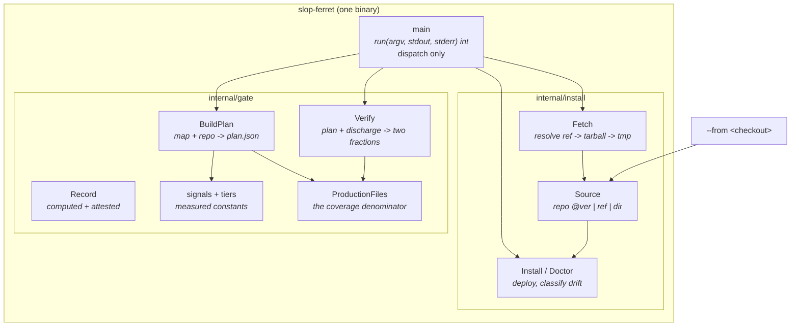

# C4 Component Diagram

Internal structure of the slop-ferret binary.

## Why the pieces sit where they do

**`main` is dispatch only.** `run(argv, stdout, stderr) int` lifts the process boundary out so
dispatch is testable; `main()` then contains nothing that can be wrong except wiring a compiler
already checks.

**`internal/gate` holds the measured constants.** The signal vocabulary, the tier split and the
defer floor were each derived from a real repository, and the measurements live in comments beside
the tests that pin them. They are in one package so that changing one forces you past the comment
explaining what it cost to learn.

**`internal/install` owns provenance, not just copying.** `Source` exists because the skill and the
binary have different release cadences: prose changes far more often than code. `classify` is what
distinguishes *"the binary moved on"* from *"you edited the deployed copy"*, which the retired
digest-stamping scheme could never do.

**No prose is compiled in.** The binary acquires the skill — from the repository at its own
version by default, a ref, or a checkout. That makes the two cadences structural: a binary that
cannot carry prose cannot re-couple them by accident.

## The seam that is deliberately not here

There is **no report generator**. The HTML report is authored against the spec in
`skill/commands/`, because judging severity and writing an honest narrative is the judgement half.
Keeping the spec in the skill means it revises without a binary release.
