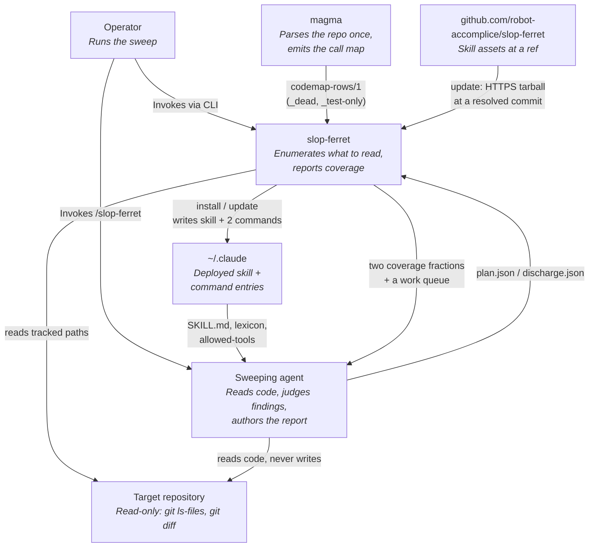

# C4 Context Diagram

Shows slop-ferret in the context of the systems and actors it interacts with.

## Boundaries worth naming

**slop-ferret never writes to the target repository.** The sweep method it supports is
additive-only against the target by design, and the tool's only reads there are `git ls-files` and
`git diff --name-only`.

**The agent, not the tool, decides anything.** slop-ferret raises candidates and counts coverage;
whether a candidate is a real finding is a judgement call that stays with whoever is sweeping. The
tool cannot establish that a file was *read* — `read_paths` is self-reported and nothing here
corroborates it. Attestation is still worth requiring because it makes an omission a statement
someone made rather than a gap nobody owns.

**`~/.claude` is a security boundary, not just a config directory.** The command entries determine
which tools a sweep session is granted. A skill that cannot be invoked is a skill whose
`allowed-tools` never applies — which is how a sweep once ran holding two tools it was meant to be
denied.
