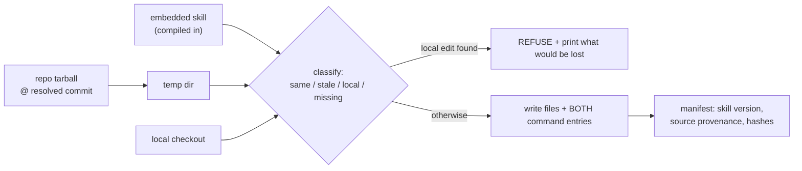

# Dataflow

How a sweep moves through the system, and where each number comes from.

```mermaid
sequenceDiagram
    participant Op as Operator
    participant M as magma
    participant SF as slop-ferret
    participant A as Sweeping agent
    participant R as Target repo

    Op->>M: magma --depth 1 <repo> <name> ~/.slop-ferret/maps
    M->>R: parse (RTA reachability)
    M-->>SF: .magma/_dead.json, _test-only.json (codemap-rows/1, sha)

    Op->>SF: slop-ferret plan <map> <sha> <repo> [--since <ref>]
    SF->>SF: refuse unless contract_version known AND map sha == pinned sha
    SF->>R: git ls-files
    SF->>SF: production = tracked - (tests, docs, vendored, generated)
    SF->>SF: worklist = production matching an H signal (RANKING)
    SF->>SF: h_unmatched = production - worklist (THE COMPLEMENT)
    SF->>R: git diff --name-only <ref>..HEAD (only with --since)
    SF-->>A: plan.json — candidates + bars, worklist, complement, denominator

    A->>R: read code, reproduce findings RED
    A->>A: clear or refute each candidate; attest or waive each path
    A-->>SF: discharge.json

    Op->>SF: slop-ferret verify plan.json discharge.json
    SF-->>A: coverage.repo, coverage.plan, remaining[], exit 0|3
```

## Where each number comes from

| output | derived from |
|---|---|
| `production_total` | tracked files, minus tests/docs/vendored/generated, **intersected with a source-extension allowlist** |
| `production_unclassified` | survived the exclusions but no known source extension — reported so an unsupported language cannot shrink the denominator silently |
| `h_worklist` | production paths matching an H signal — a **ranking**, not an admission gate |
| `h_unmatched` | `production − h_worklist` — the files no signal reached |
| `h_unmatched_changes` | changed-since-`<ref>` files no signal reached — a **strict subset** of the blind spots, bounded by the baseline |
| `coverage.repo` | `|read ∩ production| / |production|`. **Waived counts as unread.** |
| `coverage.plan` | dispositioned items / (required + deferred + unmatched) |
| exit code | `3` if anything raised is undispositioned, else `0`. Bookkeeping only. |

## The two enumerations, and why both exist

The worklist is derived from **names**, and names are chosen by the same authors whose code is
being audited. That is why it under-enumerates silently: a subsystem nobody named is simply absent.

`--since` was the first repair — compare the enumeration against a set already known to matter,
what actually changed. But that measures the *changed subset* of the blind spots, and on a mature
repository long-lived high-consequence code is exactly the code not in the diff.

The complement (`h_unmatched`) is the second repair and the load-bearing one. Every production file
is raised; signals only rank. A file no signal reached is *undispositioned* rather than absent, so
the tool can tell "cleared" from "never existed".

**Measured:** a repo's most dangerous file — an unauthenticated localhost HTTP server making
arbitrary outbound fetches — matched no signal *and* had not changed since the release baseline. It
appeared in neither `h_worklist` nor `h_unmatched_changes`, and the run still reported COMPLETE. It
was found by hand and became the sweep's worst finding.

## Install / update dataflow



`stale` means the deployed file matches what this installer last wrote but the source has moved on
— *"run update"*. `local` means it matches neither — *"you edited the deployed copy, and your
change is not in the repo"*. Distinguishing those two is the whole reason the manifest records
per-file hashes; a scheme that only hashed the tree could say *something changed* and never *what*.
